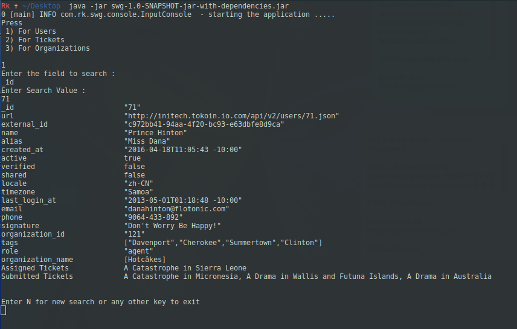

# SWG Search

## Requirements
* JDK 1.8
* Maven 3.x

## How to run

* Clone the repository
* Open the swg-search/src/main/resources/log4j.properties and change the log location 

```
log4j.appender.file.File=/tmp/app.log
```
* Build the project
```
 mvn clean compile assembly:single 
``` 

Jar file is created in the target directory, goto target dir and

# Run the jar
```
java -jar swg-1.0-SNAPSHOT-jar-with-dependencies.jar 
```

# Run tests
```
mvn test
```
 
# Sample
        

